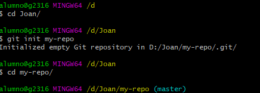
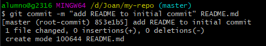
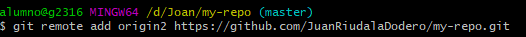

# Contribuir a repositorio existente

# Crear repositorio y subirlo a git

  - Creamos un repositorio megiante git init my-repo.
  - Nos situamos en el mediante cd

 

 - Creamos un archivo README.md mediante el comando touch.
 - Lo añadimos mediante un git add.

 

 - Hacemos un git commit -m "comentario" README.md para actualizar los cambios.

 

 - Usasmos git remote add origin https://github.com/JoanRiudalaDodero/my-repo.git para añadir el repositorio a github.

 

 - Usamos git push --set-upstream origin "la rama" para actualizar la rama.

# Contribuir a rama existente

