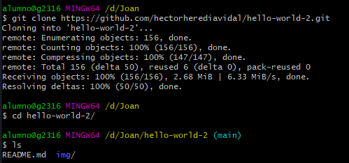
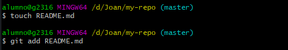

# Contribuir a repositorio existente

 - Clonamos la tarea mediante un git clone y el link.
 - Nos situamos en el repositorio creado mediante cd.

 

 - Creamo una rama llamada my-branch mediante git branch y el nombre de la rama.
 - Nos situamos en ella mediante git checkout y el nombre.

 
 
 - Creamos 2 archivos mediante touch, los llamaremos file1.md y file2.md
 - Los subimos mediante git add y los nombres.

 

 - Hacemos un git commit -m y los archivos para actualizar los cambios.

 

 - Hacemos un git push origin my-branch para subir los cambios. 

# Crear repositorio y subirlo a git

  - Creamos un repositorio megiante git init my-repo.
  - Nos situamos en el mediante cd

 

 - Creamos un archivo README.md mediante el comando touch.
 - Lo añadimos mediante un git add.

 

 - Hacemos un git commit -m "comentario" README.md para actualizar los cambios.

 

 - Usasmos git remote add origin https://github.com/JoanRiudalaDodero/my-repo.git para añadir el repositorio a github.

 

 - Usamos git push --set-upstream origin "la rama" para actualizar la rama.

# Contribuir a rama existente

